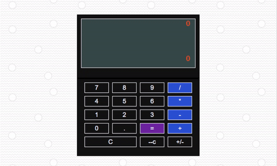

 _"What the f.... are you, a programmer,_ 
 _if you didn't make a calculator!!!"_  
  _- A random person from Habr._ 

# Calculator Project

## Description

The "Calculator" project is an interactive calculator that can perform standard arithmetic operations such as addition, subtraction, multiplication, and division. The calculator supports input of not only integers but also decimal numbers and negative numbers. Users can easily delete one character at a time or clear the entire input. One of the unique features of this calculator is its user-friendly interface, allowing interaction through buttons without the use of an input field.

## Project Goal

The main goal of this project was to create a calculator using the React and Redux libraries and to address various challenges related to data processing and state management within the application. During the development of the calculator, various JavaScript language features were explored and tested when working with different data types. An important aspect was handling situations related to division by zero and operations between numbers and strings.

## Tools and Technologies

       

The project was developed using the following tools and technologies:
- **React**: The React library was used to create the project's interface and components.
- **Redux**: Redux was used to manage the application's state.
- **Math.js**: The Math.js library was used to perform mathematical operations without using `eval`.
- **Jest**: Unit tests were written using Jest.
- **HTML and CSS**: The design of the calculator was inspired by the Apple calculator style, giving the project a modern and minimalist design.

## Worked JavaScript Features

During the creation of the "Calculator" project, various JavaScript language features were worked on and tested when dealing with different data types:

### 1. Division by 0
A check for division by zero (0) was implemented to prevent errors and incorrect results when attempting to divide a number by zero. Users receive a notification about the impossibility of performing the operation.

### 2. Addition of Numbers and Strings
The JavaScript feature where the "+" operator can be used for string concatenation and number addition was studied. This allowed for proper handling of scenarios where users input numbers and operators, with efforts made to prevent concatenation of numbers and strings.

### 3. Division of Number by String
A situation where dividing a number by a string can lead to unexpected results was identified. To ensure the correct operation of the application, input validation was performed, and users are notified of an error if they attempt to divide a number by a string.

### 4. Input of Non-Integer and Negative Values
The project supports the input of non-integer numbers (floating-point) and negative values, requiring special attention to the processing of input data for proper handling.

All these features were meticulously worked on and tested using the Jest framework to ensure reliable and stable functioning of the calculator when working with different data types.

### The deployed project can be found at the following link: ...    
